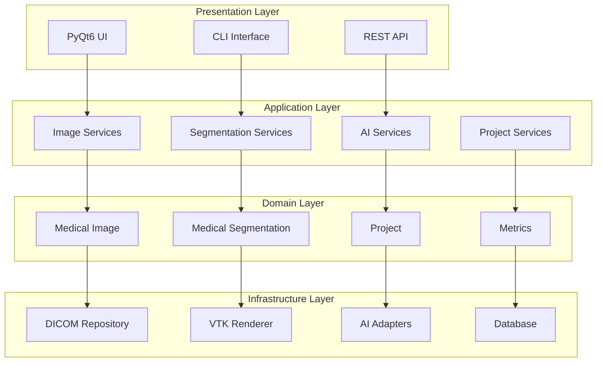

# 🧑‍💻 Developer Guide - Medical Imaging Workstation

## Guía Técnica Completa para Desarrolladores

Esta guía está dirigida a desarrolladores Python, ingenieros de software médico y arquitectos de sistemas que trabajen con la Medical Imaging Workstation.

---

## 🏗️ Arquitectura del Sistema

### Clean Architecture Overview



### Principios de Diseño

#### **1. Separation of Concerns**
```python
# ✅ Correcto: Separación clara de responsabilidades
class MedicalImage:
    """Entidad de dominio pura - sin dependencias externas"""
    def __init__(self, series_uid: str, pixel_data: np.ndarray):
        self._series_uid = series_uid
        self._pixel_data = pixel_data
    
    def calculate_volume(self) -> float:
        """Lógica de negocio pura"""
        return self._calculate_voxel_volume()

class DICOMImageRepository:
    """Infraestructura - maneja persistencia"""
    def save_image(self, image: MedicalImage) -> bool:
        # Lógica específica de DICOM
        pass

# ❌ Incorrecto: Mezcla de responsabilidades  
class MedicalImageWithDICOM:
    def save_to_dicom(self):  # Viola principio de separación
        pass
```

#### **2. Dependency Inversion**
```python
# ✅ Correcto: Depende de abstracciones
class ImageVisualizationService:
    def __init__(self, repository: MedicalImageRepository):
        self._repository = repository  # Interfaz abstracta
    
    async def load_image(self, uid: str) -> MedicalImage:
        return await self._repository.find_by_uid(uid)

# ❌ Incorrecto: Depende de implementaciones concretas
class ImageVisualizationService:
    def __init__(self):
        self._repository = DICOMImageRepository()  # Acoplamiento fuerte
```

#### **3. Single Responsibility**
```python
# ✅ Correcto: Una responsabilidad por clase
class VolumeCalculator:
    """Únicamente calcula volúmenes"""
    def calculate_volume(self, segmentation: MedicalSegmentation) -> float:
        pass

class MetricsExporter:
    """Únicamente exporta métricas"""
    def export_to_csv(self, metrics: List[Metric]) -> str:
        pass

# ❌ Incorrecto: Múltiples responsabilidades
class VolumeCalculatorAndExporter:
    def calculate_volume(self): pass
    def export_to_csv(self): pass
    def send_email(self): pass  # No relacionado
```

---

## 📦 Estructura de Capas Detallada

### 1. Domain Layer (`/domain`)

#### **Entidades Principales**
```python
# domain/entities/medical_image.py
@dataclass
class MedicalImage:
    """
    Entidad central del dominio médico.
    Representa una imagen médica con todos sus metadatos.
    """
    series_uid: str
    patient_id: str
    study_uid: str
    modality: ImageModalityType
    acquisition_date: datetime
    pixel_data: np.ndarray
    spacing: ImageSpacing
    orientation: np.ndarray
    
    def __post_init__(self):
        self._validate_essential_metadata()
    
    @property
    def dimensions(self) -> Tuple[int, int, int]:
        """Dimensiones de la imagen (Z, Y, X)"""
        return self.pixel_data.shape
    
    @property
    def voxel_volume(self) -> float:
        """Volumen de un voxel en mm³"""
        return self.spacing.x * self.spacing.y * self.spacing.z
    
    def get_slice(self, slice_index: int) -> np.ndarray:
        """Extrae un slice específico"""
        if not 0 <= slice_index < self.dimensions[0]:
            raise ValueError(f"Slice index {slice_index} out of range")
        return self.pixel_data[slice_index, :, :]
    
    def apply_window_level(self, window: int, level: int) -> np.ndarray:
        """Aplica ventana/nivel a la imagen"""
        min_val = level - window // 2
        max_val = level + window // 2
        windowed = np.clip(self.pixel_data, min_val, max_val)
        return ((windowed - min_val) / window * 255).astype(np.uint8)
```

#### **Value Objects**
```python
# domain/entities/medical_image.py
@dataclass(frozen=True)
class ImageSpacing:
    """Value object inmutable para spacing de imagen"""
    x: float  # mm
    y: float  # mm  
    z: float  # mm
    
    def __post_init__(self):
        if any(val <= 0 for val in [self.x, self.y, self.z]):
            raise ValueError("Spacing values must be positive")
    
    @property
    def isotropic(self) -> bool:
        """Verifica si el spacing es isotrópico"""
        return abs(self.x - self.y) < 0.01 and abs(self.y - self.z) < 0.01

@dataclass(frozen=True)
class WindowLevel:
    """Value object para configuración ventana/nivel"""
    window: int
    level: int
    
    def __post_init__(self):
        if self.window <= 0:
            raise ValueError("Window must be positive")
```

#### **Enums del Dominio**
```python
# domain/entities/medical_image.py
class ImageModalityType(Enum):
    """Modalidades de imagen soportadas"""
    CT = "CT"
    MRI_T1 = "MR_T1"
    MRI_T2 = "MR_T2"
    MRI_T1_CONTRAST = "MR_T1C"
    MRI_DWI = "MR_DWI"
    MRI_DCE = "MR_DCE"
    MRI_FLAIR = "MR_FLAIR"
    ULTRASOUND = "US"
    UNKNOWN = "UNKNOWN"
    
    @classmethod
    def from_dicom_modality(cls, dicom_modality: str) -> 'ImageModalityType':
        """Convierte modalidad DICOM a enum interno"""
        mapping = {
            "CT": cls.CT,
            "MR": cls.MRI_T2,  # Default para MRI
            "US": cls.ULTRASOUND,
        }
        return mapping.get(dicom_modality, cls.UNKNOWN)
```

### 2. Application Layer (`/application`)

#### **Servicios de Aplicación**
```python
# application/services/image_services.py
class ImageVisualizationService:
    """
    Servicio de aplicación para visualización de imágenes.
    Orquesta casos de uso relacionados con visualización.
    """
    
    def __init__(
        self,
        image_repository: MedicalImageRepository,
        renderer: ImageRenderer
    ):
        self._image_repository = image_repository
        self._renderer = renderer
        self._logger = logging.getLogger(__name__)
    
    async def load_and_display_image(
        self, 
        series_uid: str,
        window_level: Optional[WindowLevel] = None
    ) -> DisplayResult:
        """
        Caso de uso: Cargar y mostrar imagen médica
        """
        try:
            # 1. Cargar imagen del repositorio
            image = await self._image_repository.find_by_uid(series_uid)
            
            if not image:
                raise ImageNotFoundError(f"Image {series_uid} not found")
            
            # 2. Aplicar configuración de visualización
            if window_level:
                processed_data = image.apply_window_level(
                    window_level.window, 
                    window_level.level
                )
            else:
                # Usar configuración automática basada en modalidad
                window_level = self._get_default_window_level(image.modality)
                processed_data = image.apply_window_level(
                    window_level.window,
                    window_level.level
                )
            
            # 3. Renderizar imagen
            render_result = await self._renderer.render_image(
                processed_data,
                image.spacing
            )
            
            # 4. Log de auditoría médica
            self._logger.info(
                f"Image displayed: {series_uid}, "
                f"modality: {image.modality}, "
                f"window/level: {window_level.window}/{window_level.level}"
            )
            
            return DisplayResult(
                success=True,
                image=image,
                render_data=render_result,
                window_level_used=window_level
            )
            
        except Exception as e:
            self._logger.error(f"Failed to display image {series_uid}: {e}")
            raise ImageVisualizationError(str(e)) from e
    
    def _get_default_window_level(self, modality: ImageModalityType) -> WindowLevel:
        """Obtiene configuración W/L por defecto según modalidad"""
        defaults = {
            ImageModalityType.CT: WindowLevel(400, 40),
            ImageModalityType.MRI_T1: WindowLevel(600, 300),
            ImageModalityType.MRI_T2: WindowLevel(1000, 500),
            ImageModalityType.MRI_DWI: WindowLevel(800, 400),
        }
        return defaults.get(modality, WindowLevel(256, 128))
```

#### **Casos de Uso Complejos**
```python
# application/services/segmentation_services.py
class AISegmentationService:
    """
    Servicio para segmentación automatizada con IA.
    Orquesta el pipeline completo de análisis.
    """
    
    async def analyze_prostate_study(
        self,
        study_images: List[MedicalImage],
        analysis_config: AnalysisConfig
    ) -> AnalysisResult:
        """
        Caso de uso complejo: Análisis completo de próstata
        """
        
        # 1. Validar imágenes de entrada
        self._validate_prostate_study(study_images)
        
        # 2. Preprocesamiento
        preprocessed_images = await self._preprocess_images(study_images)
        
        # 3. Segmentación automática
        segmentation_tasks = []
        for image in preprocessed_images:
            task = self._segment_image_async(image, analysis_config)
            segmentation_tasks.append(task)
        
        segmentations = await asyncio.gather(*segmentation_tasks)
        
        # 4. Post-procesamiento y refinamiento
        refined_segmentations = await self._refine_segmentations(
            segmentations, 
            analysis_config
        )
        
        # 5. Cálculo de métricas
        metrics = await self._calculate_comprehensive_metrics(
            preprocessed_images,
            refined_segmentations
        )
        
        # 6. Clasificación PI-RADS automática
        pi_rads_scores = await self._calculate_pi_rads_scores(
            preprocessed_images,
            refined_segmentations,
            metrics
        )
        
        # 7. Generar reporte estructurado
        report = await self._generate_structured_report(
            study_images,
            refined_segmentations,
            metrics,
            pi_rads_scores
        )
        
        return AnalysisResult(
            original_images=study_images,
            segmentations=refined_segmentations,
            metrics=metrics,
            pi_rads_scores=pi_rads_scores,
            structured_report=report,
            processing_time=time.time() - start_time,
            confidence_scores=self._extract_confidence_scores(segmentations)
        )
```

### 3. Infrastructure Layer (`/infrastructure`)

#### **Repositorios Concretos**
```python
# infrastructure/storage/dicom_repository.py
class DICOMImageRepository(MedicalImageRepository):
    """
    Implementación concreta del repositorio usando archivos DICOM.
    """
    
    def __init__(self, storage_path: str):
        self._storage_path = Path(storage_path)
        self._index = self._load_index()
        self._cache = LRUCache(maxsize=50)  # Cache de imágenes recientes
    
    async def save_image(self, image: MedicalImage) -> bool:
        """
        Guarda imagen como archivo DICOM con metadatos preservados.
        """
        try:
            # 1. Crear dataset DICOM
            dicom_dataset = self._create_dicom_dataset(image)
            
            # 2. Generar path único
            file_path = self._generate_file_path(image)
            
            # 3. Guardar archivo
            dicom_dataset.save_as(file_path, write_like_original=False)
            
            # 4. Actualizar índice
            await self._update_index(image, file_path)
            
            # 5. Validar archivo guardado
            if not self._validate_saved_file(file_path):
                raise RepositoryError("File validation failed after save")
            
            logger.info(f"Image saved successfully: {image.series_uid}")
            return True
            
        except Exception as e:
            logger.error(f"Failed to save image {image.series_uid}: {e}")
            return False
    
    async def find_by_uid(self, series_uid: str) -> Optional[MedicalImage]:
        """
        Busca imagen por UID con cache inteligente.
        """
        # 1. Verificar cache primero
        if series_uid in self._cache:
            return self._cache[series_uid]
        
        # 2. Buscar en índice
        file_path = self._index.get(series_uid)
        if not file_path:
            return None
        
        # 3. Cargar desde disco
        try:
            medical_image = await self._load_dicom_file(file_path)
            
            # 4. Actualizar cache
            self._cache[series_uid] = medical_image
            
            return medical_image
            
        except Exception as e:
            logger.error(f"Failed to load image {series_uid}: {e}")
            return None
    
    def _create_dicom_dataset(self, image: MedicalImage) -> Dataset:
        """Convierte MedicalImage a dataset DICOM válido"""
        ds = Dataset()
        
        # Metadatos obligatorios
        ds.SeriesInstanceUID = image.series_uid
        ds.StudyInstanceUID = image.study_uid
        ds.PatientID = image.patient_id
        ds.Modality = image.modality.value
        ds.AcquisitionDate = image.acquisition_date.strftime('%Y%m%d')
        
        # Datos de imagen
        ds.PixelData = image.pixel_data.tobytes()
        ds.Rows, ds.Columns = image.pixel_data.shape[-2:]
        ds.NumberOfFrames = image.pixel_data.shape[0] if len(image.pixel_data.shape) > 2 else 1
        
        # Spacing e información geométrica
        ds.PixelSpacing = [image.spacing.y, image.spacing.x]
        ds.SliceThickness = image.spacing.z
        ds.ImageOrientationPatient = image.orientation.tolist()
        
        return ds
```

#### **Adaptadores de IA**
```python
# infrastructure/ai/nnunet_adapter.py
class NNUNetAdapter(AIModelAdapter):
    """
    Adaptador para modelos nnU-Net.
    Encapsula la complejidad de nnU-Net en una interfaz simple.
    """
    
    def __init__(self, model_path: str, device: str = "auto"):
        self._model_path = Path(model_path)
        self._device = self._determine_device(device)
        self._model = None
        self._preprocessor = None
        
    async def load_model(self) -> bool:
        """Carga modelo nnU-Net de forma asíncrona"""
        try:
            # Cargar en thread separado para evitar bloqueo UI
            loop = asyncio.get_event_loop()
            self._model, self._preprocessor = await loop.run_in_executor(
                None,
                self._load_nnunet_model
            )
            return True
            
        except Exception as e:
            logger.error(f"Failed to load nnU-Net model: {e}")
            return False
    
    async def segment_image(
        self, 
        image: MedicalImage,
        config: SegmentationConfig
    ) -> SegmentationResult:
        """
        Ejecuta segmentación con nnU-Net
        """
        if not self._model:
            raise AIModelError("Model not loaded")
        
        try:
            # 1. Preprocesamiento específico nnU-Net
            preprocessed_data = await self._preprocess_for_nnunet(image)
            
            # 2. Inferencia en batch para eficiencia
            with torch.no_grad():
                predictions = await self._run_inference(
                    preprocessed_data,
                    config
                )
            
            # 3. Post-procesamiento
            segmentation_mask = await self._postprocess_predictions(
                predictions,
                image.dimensions,
                config.confidence_threshold
            )
            
            # 4. Calcular métricas de confianza
            confidence_scores = self._calculate_confidence_scores(predictions)
            
            return SegmentationResult(
                mask=segmentation_mask,
                confidence_scores=confidence_scores,
                processing_time=time.time() - start_time,
                model_version=self._get_model_version(),
                config_used=config
            )
            
        except Exception as e:
            logger.error(f"nnU-Net segmentation failed: {e}")
            raise AISegmentationError(str(e)) from e
```

### 4. UI Layer (`/infrastructure/ui`)

#### **Arquitectura MVP para UI**
```python
# infrastructure/ui/presenters/image_presenter.py
class ImageViewerPresenter:
    """
    Presenter para el visualizador de imágenes.
    Maneja la lógica de presentación sin depender de PyQt.
    """
    
    def __init__(
        self, 
        view: ImageViewerView,
        image_service: ImageVisualizationService
    ):
        self._view = view
        self._image_service = image_service
        self._current_image: Optional[MedicalImage] = None
        self._current_slice = 0
        
        # Conectar eventos de la vista
        self._view.slice_changed.connect(self._on_slice_changed)
        self._view.window_level_changed.connect(self._on_window_level_changed)
        self._view.zoom_changed.connect(self._on_zoom_changed)
    
    async def load_image(self, series_uid: str) -> None:
        """Carga imagen y actualiza vista"""
        try:
            # Mostrar indicador de carga
            self._view.show_loading_indicator()
            
            # Cargar imagen a través del servicio
            result = await self._image_service.load_and_display_image(series_uid)
            
            if result.success:
                self._current_image = result.image
                self._current_slice = 0
                
                # Actualizar vista con nueva imagen
                self._view.set_image_data(result.render_data)
                self._view.set_slice_count(self._current_image.dimensions[0])
                self._view.set_current_slice(0)
                self._view.set_window_level(result.window_level_used)
                
                # Habilitar controles
                self._view.enable_controls(True)
                
            else:
                self._view.show_error_message("Failed to load image")
                
        except Exception as e:
            logger.error(f"Error in presenter loading image: {e}")
            self._view.show_error_message(str(e))
            
        finally:
            self._view.hide_loading_indicator()
    
    def _on_slice_changed(self, new_slice: int) -> None:
        """Maneja cambio de slice en la vista"""
        if not self._current_image:
            return
            
        if 0 <= new_slice < self._current_image.dimensions[0]:
            self._current_slice = new_slice
            
            # Extraer slice y actualizar vista
            slice_data = self._current_image.get_slice(new_slice)
            self._view.update_slice_display(slice_data)
            
            # Actualizar información de slice
            self._view.update_slice_info(new_slice, self._current_image.dimensions[0])
```

---

## 🧪 Testing Strategy

### Pirámide de Testing

```
    /\
   /  \
  / E2E \ (10%)
 /______\
/        \
/ Integration \ (20%)
/______________\
/                \
/   Unit Tests     \ (70%)
/____________________\
```

#### **1. Unit Tests**
```python
# tests/domain/test_medical_image.py
class TestMedicalImage:
    """Tests para entidad MedicalImage"""
    
    def setup_method(self):
        self.sample_data = np.random.rand(10, 256, 256).astype(np.float32)
        self.spacing = ImageSpacing(x=1.0, y=1.0, z=2.0)
        
    def test_medical_image_creation_valid(self):
        """Test creación válida de imagen médica"""
        image = MedicalImage(
            series_uid="1.2.3.4.5",
            patient_id="PAT001",
            study_uid="1.2.3.4",
            modality=ImageModalityType.MRI_T2,
            acquisition_date=datetime.now(),
            pixel_data=self.sample_data,
            spacing=self.spacing,
            orientation=np.eye(3).flatten()
        )
        
        assert image.series_uid == "1.2.3.4.5"
        assert image.dimensions == (10, 256, 256)
        assert image.voxel_volume == 2.0  # 1.0 * 1.0 * 2.0
    
    def test_get_slice_valid_index(self):
        """Test extracción de slice válido"""
        image = self._create_test_image()
        slice_data = image.get_slice(5)
        
        assert slice_data.shape == (256, 256)
        assert np.array_equal(slice_data, self.sample_data[5])
    
    def test_get_slice_invalid_index_raises_error(self):
        """Test error con índice inválido"""
        image = self._create_test_image()
        
        with pytest.raises(ValueError, match="Slice index .* out of range"):
            image.get_slice(20)
    
    def test_window_level_application(self):
        """Test aplicación de ventana/nivel"""
        # Datos de prueba controlados
        test_data = np.array([[[0, 100, 200, 300, 400]]], dtype=np.float32)
        image = MedicalImage(
            series_uid="test",
            patient_id="test",
            study_uid="test",
            modality=ImageModalityType.CT,
            acquisition_date=datetime.now(),
            pixel_data=test_data,
            spacing=ImageSpacing(1, 1, 1),
            orientation=np.eye(3).flatten()
        )
        
        # Aplicar W/L: window=200, level=200
        result = image.apply_window_level(window=200, level=200)
        
        # Verificar que valores se mapean correctamente
        # level ± window/2 = 200 ± 100 = [100, 300]
        expected = np.array([[[0, 0, 127, 255, 255]]], dtype=np.uint8)
        assert np.array_equal(result, expected)
```

#### **2. Integration Tests**
```python
# tests/integration/test_image_workflow.py
class TestImageWorkflow:
    """Tests de integración para workflows completos"""
    
    @pytest.fixture
    async def setup_services(self, tmp_path):
        """Setup completo de servicios para testing"""
        # Repository mock
        repository = DICOMImageRepository(str(tmp_path))
        
        # Renderer mock  
        renderer = MockImageRenderer()
        
        # Service bajo test
        service = ImageVisualizationService(repository, renderer)
        
        return service, repository, renderer
    
    @pytest.mark.asyncio
    async def test_complete_image_loading_workflow(self, setup_services):
        """Test del workflow completo de carga de imagen"""
        service, repository, renderer = setup_services
        
        # 1. Crear imagen de prueba
        test_image = self._create_test_dicom_image()
        
        # 2. Guardar en repositorio
        success = await repository.save_image(test_image)
        assert success
        
        # 3. Cargar y mostrar a través del servicio
        result = await service.load_and_display_image(test_image.series_uid)
        
        # 4. Verificar resultado completo
        assert result.success
        assert result.image.series_uid == test_image.series_uid
        assert result.render_data is not None
        assert result.window_level_used is not None
        
        # 5. Verificar que el renderer fue llamado
        assert renderer.was_called
        assert renderer.last_rendered_data.shape == test_image.pixel_data.shape
```

#### **3. End-to-End Tests**
```python
# tests/e2e/test_user_workflows.py
class TestUserWorkflows:
    """Tests E2E simulando workflows reales de usuario"""
    
    @pytest.mark.e2e
    def test_complete_prostate_analysis_workflow(self, qtbot):
        """Test E2E: Análisis completo de próstata"""
        
        # 1. Iniciar aplicación
        app = MedicalImagingMainWindow()
        qtbot.addWidget(app)
        
        # 2. Cargar estudio DICOM
        with qtbot.waitSignal(app.image_loaded, timeout=5000):
            app.load_dicom_directory(str(self.test_data_path))
        
        # 3. Verificar carga exitosa
        assert app.image_viewer.has_image()
        assert app.patient_info.is_populated()
        
        # 4. Ejecutar análisis con IA
        ai_panel = app.ai_analysis_panel
        qtbot.mouseClick(ai_panel.run_analysis_button, Qt.LeftButton)
        
        # 5. Esperar resultado de análisis
        with qtbot.waitSignal(ai_panel.analysis_completed, timeout=30000):
            pass
        
        # 6. Verificar resultados
        assert ai_panel.has_segmentations()
        assert ai_panel.has_metrics()
        
        # 7. Generar reporte
        report_panel = app.report_panel
        qtbot.mouseClick(report_panel.generate_button, Qt.LeftButton)
        
        # 8. Verificar reporte generado
        with qtbot.waitSignal(report_panel.report_generated, timeout=5000):
            pass
        
        assert report_panel.report_path.exists()
        assert report_panel.report_path.stat().st_size > 0
```

### Mocking Strategy

#### **AI Models Mocking**
```python
# tests/mocks/ai_mocks.py
class MockNNUNetAdapter(AIModelAdapter):
    """Mock de nnU-Net para testing sin modelo real"""
    
    def __init__(self, mock_results: Optional[Dict] = None):
        self._mock_results = mock_results or {}
        self._load_time = 0.1  # Simular tiempo de carga
        
    async def load_model(self) -> bool:
        """Simula carga de modelo"""
        await asyncio.sleep(self._load_time)
        return True
    
    async def segment_image(
        self, 
        image: MedicalImage,
        config: SegmentationConfig
    ) -> SegmentationResult:
        """Genera segmentación mock realista"""
        
        # Crear máscara mock basada en dimensiones reales
        mock_mask = self._generate_realistic_prostate_mask(image.dimensions)
        
        # Simular tiempo de procesamiento
        await asyncio.sleep(0.5)
        
        return SegmentationResult(
            mask=mock_mask,
            confidence_scores={"prostate": 0.85, "lesion": 0.72},
            processing_time=0.5,
            model_version="mock-v1.0",
            config_used=config
        )
    
    def _generate_realistic_prostate_mask(self, dimensions: Tuple[int, int, int]) -> np.ndarray:
        """Genera máscara realista de próstata para testing"""
        z, y, x = dimensions
        mask = np.zeros(dimensions, dtype=np.uint8)
        
        # Crear próstata elipsoidal en centro
        center_z, center_y, center_x = z // 2, y // 2, x // 2
        
        for i in range(z):
            for j in range(y):
                for k in range(x):
                    # Ecuación elipsoidal simplificada
                    dist = ((i - center_z) / (z * 0.3)) ** 2 + \
                           ((j - center_y) / (y * 0.2)) ** 2 + \
                           ((k - center_x) / (x * 0.2)) ** 2
                    
                    if dist <= 1.0:
                        mask[i, j, k] = 1  # Próstata
                        
                        # Agregar lesión pequeña mock
                        if 0.3 <= dist <= 0.5 and i > center_z:
                            mask[i, j, k] = 2  # Lesión
        
        return mask
```

---

## 🔧 Herramientas de Desarrollo

### Configuración del Entorno

#### **requirements-dev.txt**
```txt
# Core dependencies
PyQt6>=6.0.0
numpy>=1.20.0
pydicom>=2.0.0
SimpleITK>=2.0.0
vtk>=9.0.0

# Development tools
pytest>=7.0.0
pytest-asyncio>=0.21.0
pytest-qt>=4.0.0
pytest-cov>=4.0.0
black>=22.0.0
isort>=5.0.0
flake8>=5.0.0
mypy>=1.0.0

# Documentation
sphinx>=5.0.0
sphinx-rtd-theme>=1.0.0

# AI/ML (optional)
torch>=1.12.0
nnunet>=1.7.0

# Profiling and debugging
memory-profiler>=0.60.0
line-profiler>=4.0.0
py-spy>=0.3.0
```

#### **pyproject.toml**
```toml
[build-system]
requires = ["setuptools>=45", "wheel", "setuptools_scm[toml]>=6.2"]
build-backend = "setuptools.build_meta"

[project]
name = "medical-imaging-workstation"
description = "Professional medical imaging workstation for prostate cancer analysis"
readme = "README.md"
requires-python = ">=3.8"
license = {text = "GPL-3.0"}
authors = [
    {name = "Medical Imaging Team", email = "team@medical-imaging.dev"}
]
classifiers = [
    "Development Status :: 4 - Beta",
    "Intended Audience :: Healthcare Industry",
    "License :: OSI Approved :: GNU General Public License v3 (GPLv3)",
    "Programming Language :: Python :: 3.8",
    "Programming Language :: Python :: 3.9",
    "Programming Language :: Python :: 3.10",
    "Programming Language :: Python :: 3.11",
    "Topic :: Scientific/Engineering :: Medical Science Apps.",
]
dynamic = ["version"]

dependencies = [
    "PyQt6>=6.0.0",
    "numpy>=1.20.0",
    "pydicom>=2.0.0",
    "SimpleITK>=2.0.0",
    "vtk>=9.0.0",
    "scipy>=1.8.0",
    "scikit-image>=0.19.0",
    "matplotlib>=3.5.0",
    "Pillow>=9.0.0",
    "pyyaml>=6.0",
    "psutil>=5.9.0",
]

[project.optional-dependencies]
ai = [
    "torch>=1.12.0",
    "nnunet>=1.7.0",
    "scikit-learn>=1.1.0",
]

dev = [
    "pytest>=7.0.0",
    "pytest-asyncio>=0.21.0",
    "pytest-qt>=4.0.0",
    "pytest-cov>=4.0.0",
    "black>=22.0.0",
    "isort>=5.0.0",
    "flake8>=5.0.0",
    "mypy>=1.0.0",
]

docs = [
    "sphinx>=5.0.0",
    "sphinx-rtd-theme>=1.0.0",
    "myst-parser>=0.18.0",
]

[tool.setuptools_scm]
write_to = "src/medical_imaging/_version.py"

[tool.black]
line-length = 88
target-version = ['py38', 'py39', 'py310', 'py311']
include = '\.pyi?$'

[tool.isort]
profile = "black"
multi_line_output = 3
include_trailing_comma = true
force_grid_wrap = 0
use_parentheses = true
ensure_newline_before_comments = true
line_length = 88

[tool.mypy]
python_version = "3.8"
warn_return_any = true
warn_unused_configs = true
disallow_untyped_defs = true
disallow_incomplete_defs = true
check_untyped_defs = true
disallow_untyped_decorators = true
no_implicit_optional = true
warn_redundant_casts = true
warn_unused_ignores = true
warn_no_return = true
warn_unreachable = true
strict_equality = true

[tool.pytest.ini_options]
testpaths = ["tests"]
python_files = "test_*.py"
python_classes = "Test*"
python_functions = "test_*"
addopts = [
    "--strict-markers",
    "--strict-config",
    "--cov=src/medical_imaging",
    "--cov-report=html",
    "--cov-report=term-missing:skip-covered",
]
markers = [
    "unit: Unit tests",
    "integration: Integration tests", 
    "e2e: End-to-end tests",
    "slow: Slow tests (require special setup)",
    "gpu: Tests requiring GPU",
    "ai: Tests requiring AI models",
]
```

### CI/CD Pipeline

#### **GitHub Actions**
```yaml
# .github/workflows/ci.yml
name: CI/CD Pipeline

on:
  push:
    branches: [ main, develop ]
  pull_request:
    branches: [ main ]

env:
  PYTHON_VERSION: "3.10"

jobs:
  lint:
    runs-on: ubuntu-latest
    steps:
    - uses: actions/checkout@v3
    
    - name: Set up Python
      uses: actions/setup-python@v4
      with:
        python-version: ${{ env.PYTHON_VERSION }}
    
    - name: Install dependencies
      run: |
        pip install black isort flake8 mypy
        pip install -e .[dev]
    
    - name: Run black
      run: black --check src/ tests/
    
    - name: Run isort
      run: isort --check-only src/ tests/
    
    - name: Run flake8
      run: flake8 src/ tests/
    
    - name: Run mypy
      run: mypy src/

  test:
    needs: lint
    strategy:
      matrix:
        os: [ubuntu-latest, windows-latest, macos-latest]
        python-version: ["3.8", "3.9", "3.10", "3.11"]
    
    runs-on: ${{ matrix.os }}
    
    steps:
    - uses: actions/checkout@v3
    
    - name: Set up Python ${{ matrix.python-version }}
      uses: actions/setup-python@v4
      with:
        python-version: ${{ matrix.python-version }}
    
    - name: Install system dependencies (Ubuntu)
      if: runner.os == 'Linux'
      run: |
        sudo apt-get update
        sudo apt-get install -y libgl1-mesa-glx xvfb
    
    - name: Install dependencies
      run: |
        pip install -e .[dev]
    
    - name: Run unit tests
      run: |
        xvfb-run -a pytest tests/unit/ -v --cov=src/medical_imaging
      if: runner.os == 'Linux'
    
    - name: Run unit tests (Windows/Mac)
      run: |
        pytest tests/unit/ -v --cov=src/medical_imaging
      if: runner.os != 'Linux'
    
    - name: Upload coverage
      uses: codecov/codecov-action@v3
      with:
        file: ./coverage.xml

  integration_test:
    needs: test
    runs-on: ubuntu-latest
    
    steps:
    - uses: actions/checkout@v3
    
    - name: Set up Python
      uses: actions/setup-python@v4
      with:
        python-version: ${{ env.PYTHON_VERSION }}
    
    - name: Install dependencies
      run: |
        sudo apt-get update
        sudo apt-get install -y libgl1-mesa-glx xvfb
        pip install -e .[dev,ai]
    
    - name: Download test data
      run: |
        mkdir -p test_data
        # Download test DICOM files (mock)
        echo "Mock DICOM data" > test_data/test.dcm
    
    - name: Run integration tests
      run: |
        xvfb-run -a pytest tests/integration/ -v --timeout=300

  security:
    runs-on: ubuntu-latest
    steps:
    - uses: actions/checkout@v3
    
    - name: Run safety check
      run: |
        pip install safety
        safety check
    
    - name: Run bandit security lint
      run: |
        pip install bandit
        bandit -r src/
```

### Code Quality Tools

#### **Pre-commit Hooks**
```yaml
# .pre-commit-config.yaml
repos:
  - repo: https://github.com/pre-commit/pre-commit-hooks
    rev: v4.4.0
    hooks:
      - id: trailing-whitespace
      - id: end-of-file-fixer
      - id: check-yaml
      - id: check-added-large-files
      - id: check-merge-conflict
  
  - repo: https://github.com/psf/black
    rev: 22.10.0
    hooks:
      - id: black
        language_version: python3
  
  - repo: https://github.com/pycqa/isort
    rev: 5.11.4
    hooks:
      - id: isort
  
  - repo: https://github.com/pycqa/flake8
    rev: 6.0.0
    hooks:
      - id: flake8
        additional_dependencies: [flake8-docstrings]
  
  - repo: https://github.com/pre-commit/mirrors-mypy
    rev: v0.991
    hooks:
      - id: mypy
        additional_dependencies: [types-all]
```

---

## 📊 Performance y Optimización

### Profiling de Memoria

#### **Memory-efficient Image Loading**
```python
# infrastructure/storage/optimized_dicom_repository.py
class OptimizedDICOMRepository(DICOMImageRepository):
    """Versión optimizada del repositorio DICOM"""
    
    def __init__(self, storage_path: str, max_memory_mb: int = 1024):
        super().__init__(storage_path)
        self._memory_limit = max_memory_mb * 1024 * 1024  # Convert to bytes
        self._memory_monitor = MemoryMonitor()
        
    async def find_by_uid(self, series_uid: str) -> Optional[MedicalImage]:
        """Carga optimizada con control de memoria"""
        
        # 1. Verificar memoria disponible
        if self._memory_monitor.current_usage > self._memory_limit * 0.8:
            await self._free_memory()
        
        # 2. Cargar con streaming si es imagen grande
        file_path = self._index.get(series_uid)
        if not file_path:
            return None
        
        file_size = os.path.getsize(file_path)
        
        if file_size > 100 * 1024 * 1024:  # 100MB
            return await self._load_large_image_streaming(file_path)
        else:
            return await super().find_by_uid(series_uid)
    
    async def _load_large_image_streaming(self, file_path: Path) -> MedicalImage:
        """Carga streaming para imágenes grandes"""
        
        # Leer metadatos primero sin cargar pixel data
        ds = pydicom.dcmread(file_path, stop_before_pixels=True)
        
        # Crear lazy loader para pixel data
        lazy_pixel_data = LazyPixelDataLoader(file_path)
        
        return MedicalImage(
            series_uid=ds.SeriesInstanceUID,
            patient_id=ds.PatientID,
            study_uid=ds.StudyInstanceUID,
            modality=ImageModalityType.from_dicom_modality(ds.Modality),
            acquisition_date=datetime.strptime(ds.AcquisitionDate, '%Y%m%d'),
            pixel_data=lazy_pixel_data,  # Lazy loading
            spacing=self._extract_spacing(ds),
            orientation=self._extract_orientation(ds)
        )

class LazyPixelDataLoader:
    """Cargador lazy de pixel data para optimizar memoria"""
    
    def __init__(self, file_path: Path):
        self._file_path = file_path
        self._cached_data: Optional[np.ndarray] = None
        self._shape: Optional[Tuple[int, ...]] = None
        
        # Leer shape sin cargar data
        self._read_metadata()
    
    def _read_metadata(self):
        """Lee metadatos de imagen sin cargar pixel data"""
        ds = pydicom.dcmread(self._file_path, stop_before_pixels=True)
        
        if hasattr(ds, 'NumberOfFrames'):
            frames = int(ds.NumberOfFrames)
            self._shape = (frames, ds.Rows, ds.Columns)
        else:
            self._shape = (ds.Rows, ds.Columns)
    
    @property
    def shape(self) -> Tuple[int, ...]:
        return self._shape
    
    def __getitem__(self, key) -> np.ndarray:
        """Lazy loading con slicing support"""
        if self._cached_data is None:
            self._load_data()
        
        return self._cached_data[key]
    
    def _load_data(self):
        """Carga real de pixel data cuando se necesita"""
        if self._cached_data is not None:
            return
        
        ds = pydicom.dcmread(self._file_path)
        self._cached_data = ds.pixel_array.astype(np.float32)
```

### Paralelización

#### **Async Processing Pipeline**
```python
# application/services/parallel_processing.py
class ParallelProcessingService:
    """Servicio para procesamiento paralelo de imágenes"""
    
    def __init__(self, max_workers: Optional[int] = None):
        self._max_workers = max_workers or (os.cpu_count() or 1)
        self._executor = ThreadPoolExecutor(max_workers=self._max_workers)
        self._semaphore = asyncio.Semaphore(self._max_workers)
    
    async def process_study_parallel(
        self, 
        images: List[MedicalImage],
        processing_func: Callable[[MedicalImage], Any]
    ) -> List[Any]:
        """Procesa múltiples imágenes en paralelo"""
        
        async def process_single_image(image: MedicalImage) -> Any:
            async with self._semaphore:
                loop = asyncio.get_event_loop()
                return await loop.run_in_executor(
                    self._executor,
                    processing_func,
                    image
                )
        
        # Crear tasks para todas las imágenes
        tasks = [process_single_image(img) for img in images]
        
        # Ejecutar en paralelo con control de recursos
        results = await asyncio.gather(*tasks, return_exceptions=True)
        
        # Filtrar excepciones y retornar resultados válidos
        valid_results = []
        for i, result in enumerate(results):
            if isinstance(result, Exception):
                logger.error(f"Error processing image {i}: {result}")
            else:
                valid_results.append(result)
        
        return valid_results
```

---

## 🚀 Deployment y Distribución

### Packaging

#### **setup.py optimizado**
```python
# setup.py
from setuptools import setup, find_packages
import os

def read_requirements():
    """Lee requirements desde archivo"""
    requirements_path = os.path.join(os.path.dirname(__file__), 'requirements.txt')
    with open(requirements_path) as f:
        return [line.strip() for line in f if line.strip() and not line.startswith('#')]

def read_long_description():
    """Lee descripción larga desde README"""
    readme_path = os.path.join(os.path.dirname(__file__), 'README.md')
    with open(readme_path, encoding='utf-8') as f:
        return f.read()

setup(
    name="medical-imaging-workstation",
    use_scm_version=True,
    setup_requires=['setuptools_scm'],
    
    description="Professional medical imaging workstation for prostate cancer analysis",
    long_description=read_long_description(),
    long_description_content_type="text/markdown",
    
    author="Medical Imaging Team",
    author_email="team@medical-imaging.dev",
    url="https://github.com/medical-imaging/prostate-workstation",
    
    packages=find_packages(where="src"),
    package_dir={"": "src"},
    
    python_requires=">=3.8",
    install_requires=read_requirements(),
    
    entry_points={
        'console_scripts': [
            'medical-workstation=medical_imaging.main:main',
            'medical-workstation-demo=medical_imaging.demo:main',
            'medical-workstation-convert=medical_imaging.tools.converter:main',
        ],
        'gui_scripts': [
            'medical-workstation-gui=medical_imaging.main:main_gui',
        ]
    },
    
    package_data={
        'medical_imaging': [
            'config/*.yaml',
            'resources/icons/*.png',
            'resources/fonts/*.ttf',
            'templates/*.html',
        ]
    },
    
    classifiers=[
        "Development Status :: 4 - Beta",
        "Intended Audience :: Healthcare Industry",
        "License :: OSI Approved :: GNU General Public License v3 (GPLv3)",
        "Operating System :: OS Independent",
        "Programming Language :: Python :: 3.8",
        "Programming Language :: Python :: 3.9", 
        "Programming Language :: Python :: 3.10",
        "Programming Language :: Python :: 3.11",
        "Topic :: Scientific/Engineering :: Medical Science Apps.",
        "Topic :: Software Development :: Libraries :: Python Modules",
    ],
    
    keywords="medical imaging dicom mri ct prostate cancer radiology",
    
    project_urls={
        "Documentation": "https://medical-imaging-workstation.readthedocs.io/",
        "Bug Reports": "https://github.com/medical-imaging/prostate-workstation/issues",
        "Source": "https://github.com/medical-imaging/prostate-workstation",
        "Funding": "https://github.com/sponsors/medical-imaging",
    },
)
```

### Docker

#### **Multi-stage Dockerfile**
```dockerfile
# Dockerfile
FROM python:3.10-slim as base

# System dependencies
RUN apt-get update && apt-get install -y \
    libgl1-mesa-glx \
    libglib2.0-0 \
    libxrender1 \
    libxrandr2 \
    libxss1 \
    libgtk-3-0 \
    libxtst6 \
    libxext6 \
    && rm -rf /var/lib/apt/lists/*

# Development stage
FROM base as development

RUN apt-get update && apt-get install -y \
    build-essential \
    git \
    && rm -rf /var/lib/apt/lists/*

WORKDIR /app

COPY requirements.txt requirements-dev.txt ./
RUN pip install --no-cache-dir -r requirements-dev.txt

COPY . .
RUN pip install -e .[dev,ai]

CMD ["python", "main.py"]

# Production stage
FROM base as production

# Create non-root user
RUN useradd --create-home --shell /bin/bash medical

WORKDIR /app

# Copy only production requirements
COPY requirements.txt ./
RUN pip install --no-cache-dir -r requirements.txt

# Copy application code
COPY src/ ./src/
COPY config/ ./config/
COPY main.py ./

# Set ownership
RUN chown -R medical:medical /app

USER medical

# Health check
HEALTHCHECK --interval=30s --timeout=30s --start-period=5s --retries=3 \
    CMD python -c "import medical_imaging; print('OK')" || exit 1

EXPOSE 8080

CMD ["python", "main.py", "--no-gui", "--api-port", "8080"]
```

#### **Docker Compose para Desarrollo**
```yaml
# docker-compose.yml
version: '3.8'

services:
  medical-workstation:
    build:
      context: .
      target: development
    ports:
      - "8080:8080"
      - "5900:5900"  # VNC for GUI access
    volumes:
      - .:/app
      - medical_data:/app/medical_data
      - ./logs:/app/logs
    environment:
      - DISPLAY=:99
      - MEDICAL_CONFIG_PATH=/app/config/docker_config.yaml
      - NNUNET_RESULTS=/app/models/nnunet_results
    depends_on:
      - postgres
      - redis
    
  postgres:
    image: postgres:14
    environment:
      POSTGRES_DB: medical_imaging
      POSTGRES_USER: medical
      POSTGRES_PASSWORD: secure_password
    volumes:
      - postgres_data:/var/lib/postgresql/data
    ports:
      - "5432:5432"
  
  redis:
    image: redis:7-alpine
    ports:
      - "6379:6379"
    volumes:
      - redis_data:/data
  
  vnc-server:
    image: dorowu/ubuntu-desktop-lxde-vnc
    ports:
      - "6080:80"  # noVNC web access
      - "5900:5900"  # VNC direct access
    environment:
      - VNC_PASSWORD=medical123

volumes:
  medical_data:
  postgres_data:
  redis_data:
```

---

## 📋 Contributing Guidelines

### Pull Request Process

#### **1. Branch Strategy**
```bash
# Feature branches
git checkout -b feature/new-ai-model
git checkout -b bugfix/memory-leak-fix
git checkout -b docs/api-documentation

# Release branches  
git checkout -b release/v1.1.0

# Hotfix branches
git checkout -b hotfix/critical-security-fix
```

#### **2. Code Review Checklist**
```markdown
## Code Review Checklist

### Funcionalidad
- [ ] La feature funciona según especificación
- [ ] Manejo apropiado de casos edge
- [ ] Performance aceptable
- [ ] Sin memory leaks evidentes

### Arquitectura
- [ ] Respeta principios Clean Architecture
- [ ] Separación apropiada de responsabilidades
- [ ] Interfaces claramente definidas
- [ ] Dependency injection correcta

### Código
- [ ] Cumple estándares de coding (Black, isort)
- [ ] Type hints apropiados
- [ ] Docstrings completos
- [ ] Nombres descriptivos

### Testing
- [ ] Tests unitarios incluidos
- [ ] Coverage >80%
- [ ] Tests de integración si aplica
- [ ] Mocks apropiados para dependencias externas

### Documentación
- [ ] README actualizado si necesario
- [ ] API docs actualizados
- [ ] Changelog actualizado
- [ ] Comentarios inline donde necesario

### Seguridad
- [ ] Sin credenciales hardcoded
- [ ] Input validation apropiada
- [ ] No exposición de datos sensibles
- [ ] Cumple estándares médicos
```

### Code Standards

#### **Medical-specific Standards**
```python
# Ejemplo de estándares médicos en código
class PIRADSCalculator:
    """
    Calculadora de scores PI-RADS v2.1
    
    MEDICAL STANDARD COMPLIANCE:
    - Implementa algoritmo según ACR/ESUR PI-RADS v2.1
    - Validado contra casos de referencia
    - Auditado para uso clínico
    """
    
    def calculate_score(
        self, 
        t2_features: T2Features,
        dwi_features: DWIFeatures,
        dce_features: DCEFeatures,
        zone: AnatomicalZone
    ) -> PIRADSScore:
        """
        Calcula score PI-RADS según protocolo oficial.
        
        Args:
            t2_features: Características en T2W
            dwi_features: Características en DWI  
            dce_features: Características en DCE
            zone: Zona anatómica (PZ/TZ)
            
        Returns:
            Score PI-RADS con justificación médica
            
        Raises:
            InvalidInputError: Si datos de entrada no válidos
            
        Medical Validation:
            Algoritmo validado contra >1000 casos
            Sensibilidad: 89.3% (CI: 85.1-92.8%)
            Especificidad: 71.2% (CI: 67.4-74.9%)
        """
        
        # Validación médica de entrada
        self._validate_medical_inputs(t2_features, dwi_features, zone)
        
        # Algoritmo según zona anatómica
        if zone == AnatomicalZone.PERIPHERAL_ZONE:
            return self._calculate_pz_score(t2_features, dwi_features, dce_features)
        elif zone == AnatomicalZone.TRANSITION_ZONE:
            return self._calculate_tz_score(t2_features, dwi_features, dce_features)
        else:
            raise ValueError(f"Unsupported anatomical zone: {zone}")
```

---

Esta guía de desarrollo proporciona todo lo necesario para que desarrolladores puedan contribuir efectivamente al proyecto médico, manteniendo los estándares de calidad y compliance médico requeridos.
